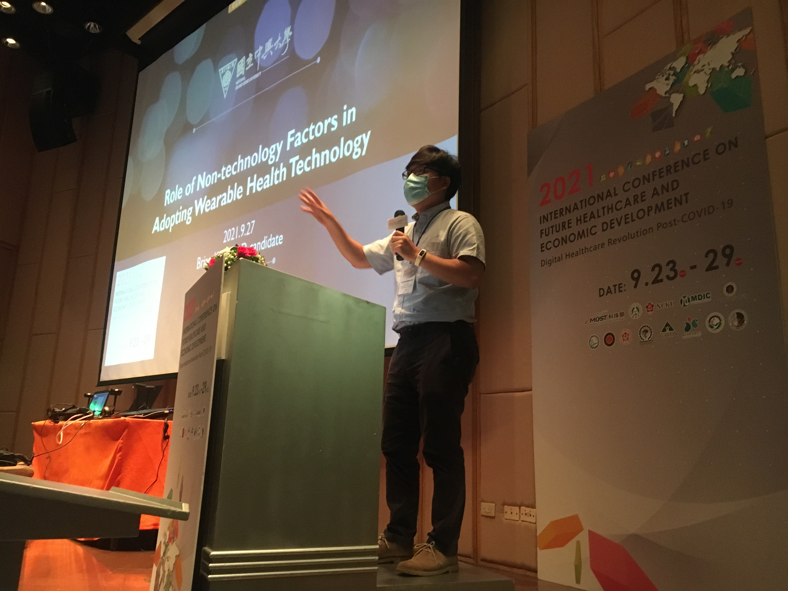

### Upcoming Talks

+ May 27, 2023. The 2023 International Conference in Management Sciences and Decision Making, Taipei, Taiwan.

### Current Position

+ 2023/2 ~ Present, Assistant Professor, Global Master of Business Administration at [Tunghai University 東海大學](https://eng.thu.edu.tw/), Taichung, Taiwan.

### Courses Taught

#### Graduate Level

+ Programming Design: Python
+ Global Business Management

#### Updergraduate Level

+ Product and Operations Management
+ Western Culture and Society

### Education

+ 2022 PhD in [Technology Management 科技管理研究所](http://itm.nchu.edu.tw/) at [National Chung Hsing University 國立中興大學](https://www.nchu.edu.tw/en-index), Taiwan
  + __Dissertation__ The Study on Wearable Health Technology: Machine Learning-based Research Trends Analysis and Role of Non-technology Factor in User Acceptance
+ Masters of Computer Science at [Texas A&M University 德州農工大學](https://engineering.tamu.edu/cse/index.html), USA
+ MS in Computer Science at [Korea University 韓國高麗大學](https://cs.korea.edu/en_cs/index.do), Korea

### Research Focus

+ [Mobile Health Technology Acceptance](https://doi.org/10.1016/j.tele.2021.101603)
+ Research Trends Analysis via Topic Modeling(Machine Learning-based Data Analysis Methodology)
+ Bibliometric Analysis for Scholarly Big Data
+ Medical Application of Machine Learning
+ [IoTs for Smart Life](#iots-for-smart-life)

### Professional Experience

+ Postdoctoral Fellow, [Institute of Statistical Scinece](https://www.stat.sinica.edu.tw), [Academia Sinica 中央研究院](https://www.sinica.edu.tw/en), Taiwan.
  + Applying machine learning techniques for discovering effective anti-cancer drugs by utilizing molecular profile of individual patient.
+ Senior System Analyst/Data Science, Supercomputing Facility, [Texas A&M University](https://www.tamu.edu/), USA
  + Improving the performance of cloud system and analyzing research big data
+ Senior Software Developer, Corecess, Korea
  + Developing firmware for embedded systems
  
### Publications (Within 5 years)

+ Kim, T. B. (2023). How machine learning disrupts medical research. The 2023 International Conference in
Management Sciences and Decision Making, Taipei, Taiwan.
+ Kim, T. B. (2023). Where is Generative AI Headed? 2023 International Conference on Information
Management, Kaohsiung, Taiwan.
+ __*IF=9.140,SSCI*__ Kim, T. B., & Ho, C.-T. B. (2021). Validating the moderating role of age in multi-perspective acceptance model of wearable healthcare technology. Telematics and Informatics, 61, 101603. [https://doi.org/10.1016/j.tele.2021.101603](https://doi.org/10.1016/j.tele.2021.101603)
+ Kim, T. B., & Ho, C.-T. B. (2022). Reality of Virtual Reality Research between 1987 and 2021. International Journal of Information and Management Sciences, 33, 345~259, doi:10.6186/IJIMS.202203_33(3).0005 (EI). *Invited from conference*

+ __*THE BEST PAPER AWARD*__ Kim, T. B., & Ho, C.-T. B. (2022, May 28). Reality of Virtual Reality Research between 1987 and 2021. The 2022 International Conference in Management Sciences and Decision Making, Taipei, Taiwan.
+ Kim, T. B., & Ho, C.-T. B. (2021). Machine Learning-based Knowledge Mapping for Bibliographic Big Data, 2021 National Computer Symposium, Taichung, Taiwan.
+ Kim, T. B., & Ho, C.-T. B. (2021). AI-based framework for discovering under-investigated topics in health information systems research. 2021 Management Concept and Application Conference, Kaohsiung, Taiwan.
+ Kim, T. B., & Ho, C.-T. B. (2021). Visual Data Exploration of Covid-19’s Impacts on Economic Research. International Conference on Information Management 2021, Taipei, Taiwan.

   
Presentation at 2021 Management Concept and Application Conference, Kaohsiung, Taiwan

### Invited Talks

+ 2021 International Conference on Future Healthcare and Economic Development｜Digital Healthcare Revolution Post-COVID-19, Medical Device Innovation Center, National Cheng Kung University, Tainan, Taiwan.

   
Invited talk at 2021 International Conference on Future Healthcare and Economic Development, Tainan, Taiwan

### Scholarships and Awards

+ Taiwan Scholarship [教育部臺灣獎學金](https://taiwanscholarship.moe.gov.tw/web/index.aspx), Ministry of Education, Taiwan, 2017~2021
+ Student Academic Publication Scholarship 國立中興大學科技管理理研所學生學術論文研究獎勵, [GITM](http://itm.nchu.edu.tw/), NCHU, 2021
+ Scholarship for attending academic conference 國立中興大學科技管理研究所學術發表獎助, [GITM](http://itm.nchu.edu.tw/), NCHU, 2021

### Reviewer for International Journals

+ Industrial Management & Data Systems (SCIE,IF=3.329)

### Coursework

+ Research Methods for Technology Management 科技管理研究方法
+ Management of Technology: Theory and Practice 科技管理理論與實務
+ Internet Business Models and Strategies 電子化策略與經營模式
+ Operations Management 營運管理
+ Service Science 服務科學
+ Electronic Customer Relationship Management 電子化顧客關係管理
+ Emerging Technology and Industry Application 新興電子商務與企業應用
+ Advanced Research Topics in E-Business 高階電子化企業研究

### Foreign Language Skills

+ English - Professional proficiency in listening, speaking, reading, and writing
+ Chinese – Advanced ([TOCFL](https://www.sc-top.org.tw/) Level 4)
  + Studied in [Feng Chia University 逢甲大學](https://www.fcu.edu.tw/)
+ Korean – Native 

### Research (Within 5 years)

#### Topic Modeling

This study analyzes the metadata of 2,296 research articles using the AI-based topic modeling method for identifying under-investigated research topics. The results of this project guide policymakers and scholars to plan research direction precisely and allocate invaluable resources effectively for the best possible outcome.

+ Requirements
   + [Web of Science Database](https://webofknowledge.com/)
   + [R](https://www.r-project.org/)
   + R Packages
      + [topicmodels](https://cran.r-project.org/web/packages/topicmodels/index.html)
      + tidyverse
      + tidytest
      + ggplot2

#### Knowledge Mapping

This study investigates the global collaboration pattern of economic research during the pandemic using co-occurrence analysis to adequately prepare solid research collaboration plans for scholars and policymakers.

+ Requirements
   + [Web of Science Database](https://webofknowledge.com/)
   + [VOSviewer](https://www.vosviewer.com)
   + [R](https://www.r-project.org/)
   + R Packages
      + bibliometrix
      + networkD3
      + htmlwidgets
      + igraph
      + tidyverse
      + ggplot2

### [IoTs for Smart Life](https://hpclab.blogspot.com/)

#### Environmental monitoring and notification system

   This system monitors CO2 levels in real-time. Then notifications are sent to mobile messengers including Line and Telegram.

   + Prerequisites
     - Arduino IDE
     - ESP8266 package for Arduino IDE
     - EPS8266 Sketch Data Upload
     - ESPAsyncTCP Library
     - ESPAsyncWebServer Library
     - Telegram Bot token and chat id

   + Requirements
      - Wemos D1 mini
      - MH-Z19B CO2 sensor

#### Cloud-based Voice Recognition System For Smart Home

   This system recognizes human voice to control LED light using Google Assistant. Then, commends are sent to IFTTT and Adafruit MQTT for executing pre-defined operations in ESP8266-based IoT device.

   
   + Prerequisites
     - Arduino IDE
     - ESP8266 package for Arduino IDE
     - EPS8266 Sketch Data Upload
     - IFTTT
     - Adafruit MQTT broker
     - Adafruit_NeoPixel Library for controlling single-wire LED pixels (NeoPixel, WS2812, etc.)

   + Requirements
     - Wemos D1 mini
     - [NeoPixel compatible LED stick](https://www.adafruit.com/product/1426)

[For more project...](https://hpclab.blogspot.com/)
